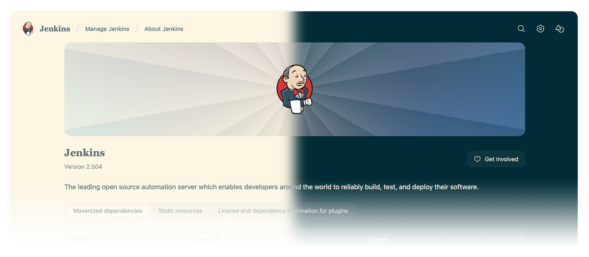

# Chocolate Theme Plugin

## Introduction

_Indulge your Jenkins in rich, dark tones with golden highlights for a refined, elegant developer experience._

This plugin provides the Chocolate theme for Jenkins.

## Usage

After installing this plugin, go to _Manage Jenkins » Appearance » Themes_ and select the Chocolate theme.

## Contributing

Refer to our [contribution guidelines](https://github.com/jenkinsci/.github/blob/master/CONTRIBUTING.md).

## LICENSE

Licensed under MIT, see [LICENSE](LICENSE.md).
